# Lab 2 – Landing Your Bronze Data into Fabric

In this lab, you will ingest your data from **Azure Data Lake Storage Gen2 (ADLS Gen2)** into **Microsoft Fabric** using a **Copy Job**. You will see all **Change Data Capture (CDC)** changes seamlessly reflected in Fabric through the Copy Job, enabling your **Bronze** data ingestion layer.

## 1. Set Up a CDC-Enabled Copy Job for Bronze Ingestion from ADLS Gen2

### Create and Configure the Source (ADLS Gen2)

1. Under the **Bronze data medallion** item, click **New item** and select **Lakehouse**.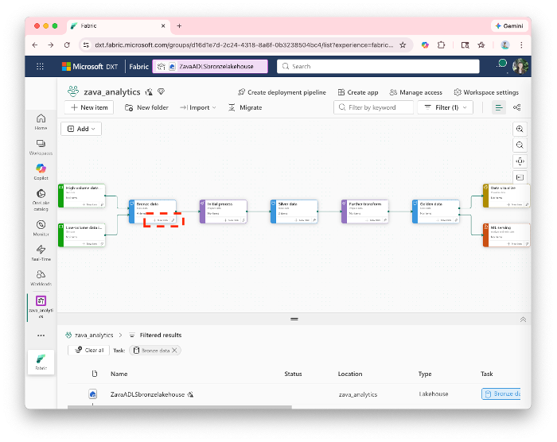 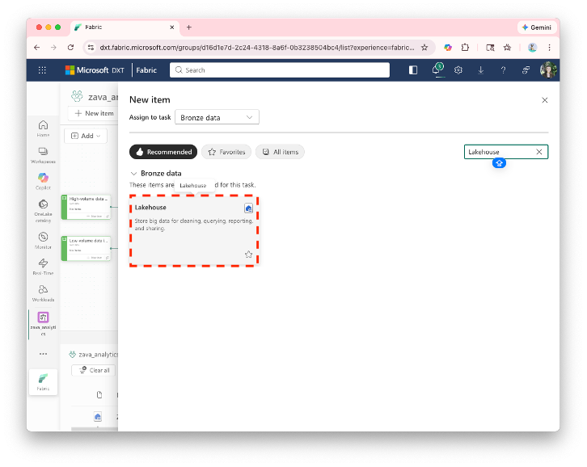

2. Name the Lakehouse \`ZavaADLSbronzelakehouse\` and click **Create**. 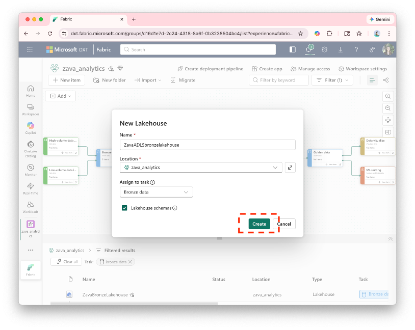

3. Go back to your workspace. Under **High-volume data ingestion**, click **New item**. 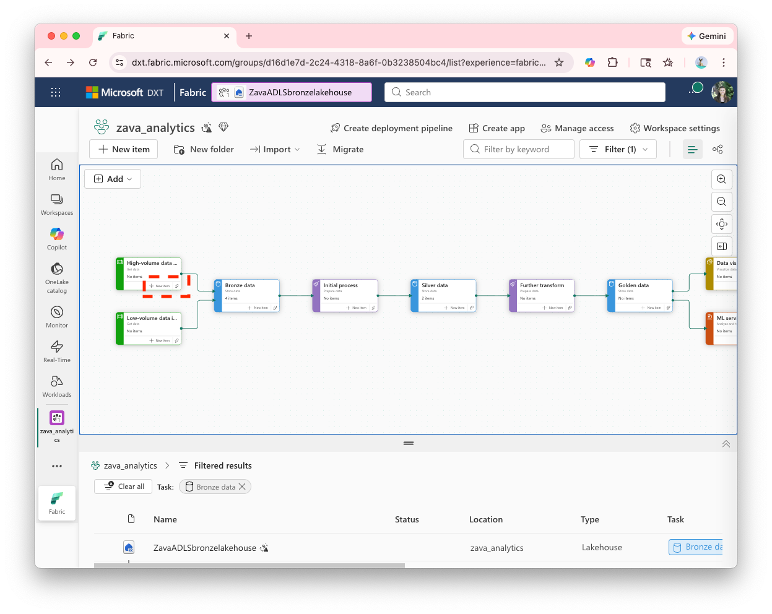

4. Select **Copy job**, name it \`Zavadataadlscopyjob\`, and click **Create**.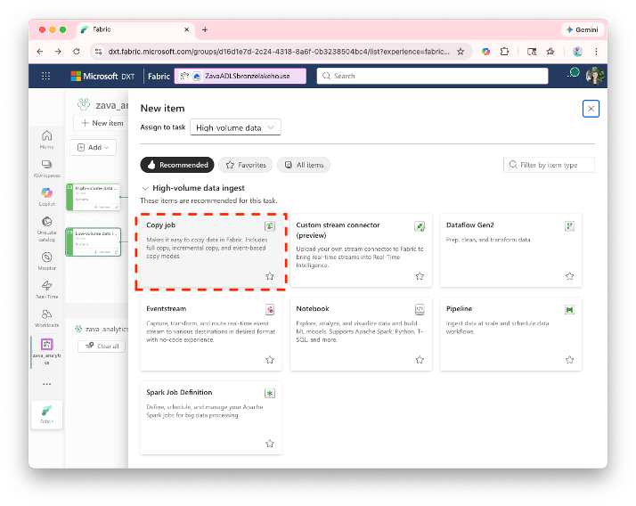

### Configure the Data Source

5. Click **New** to configure your data source. 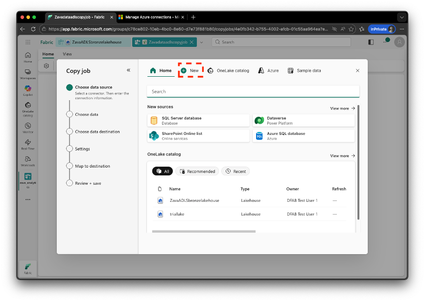

6. Search for **Azure Data Lake Storage Gen2** and select it. 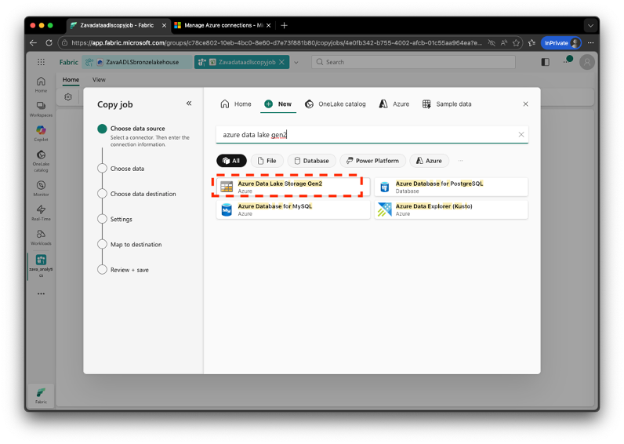

7. Enter the following values:

    - **URL**: \https://zavarawdata1.dfs.core.windows.net/
    - **Connection name**: Keep the auto-populated value
    - Check **The connection can be used with on-premises data gateways and VNet Gateways**
    - Click **Next** 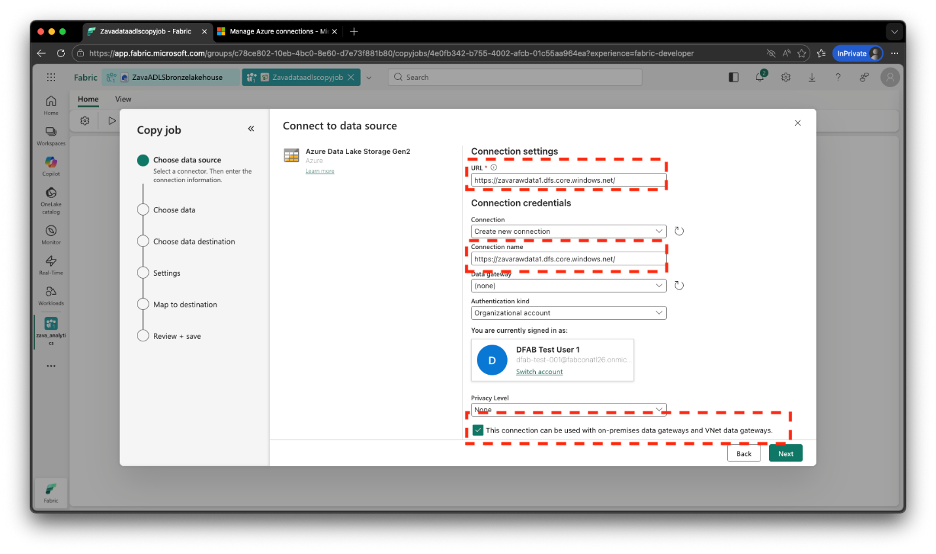

8. Expand the \`zavarawdata\` folder, then expand the \`v1\` folder.
    - Select all tables within the CSV files
        - **Do not select** the \`flag\` folder 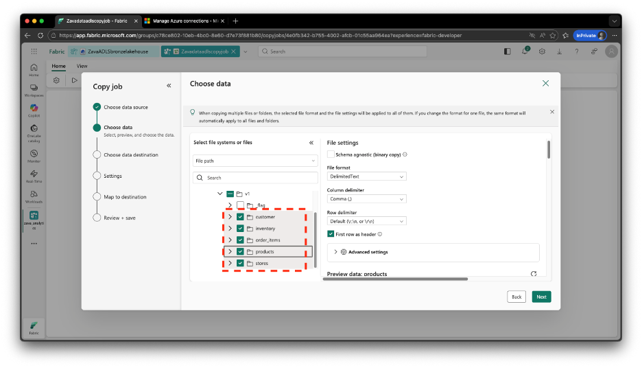

9. Click **Advanced settings**. 

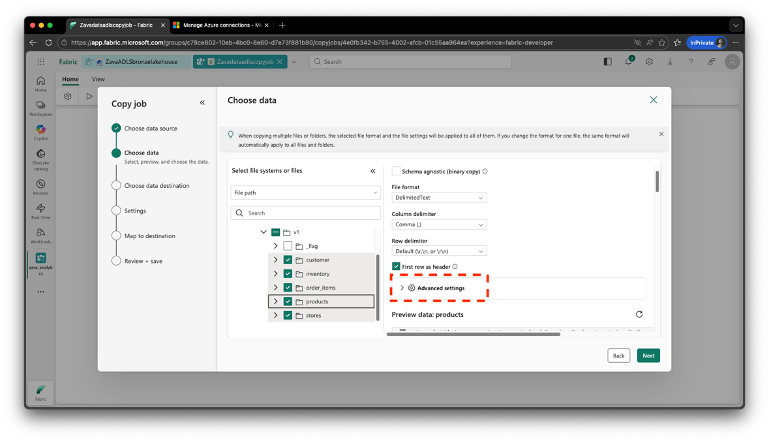

10. Select **Audit columns** and configure the following:

    - **Name**: \`\_ingestion\_timestamp\`
    -    **Value**: \`$$NOW\`
    - **Name**: \`\_source\_file\`
    -   **Value**: \`Custom\`
    -   **Right-hand textbox**: \`products.csv\`
    - **Name**: \`\_batch\_id\`
    -    **Value**: \`$$COPYJOBID\`
    - **Name**: \`\_is\_deleted\`
    -   **Value**: \`Custom\`  
    -   **Right-hand textbox**: \`false\`
   
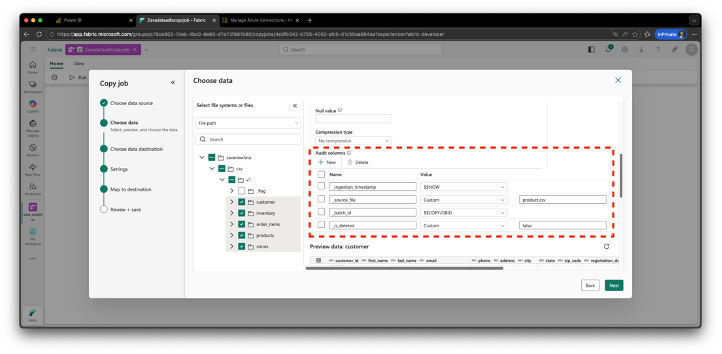

### Configure Destination and Run

11. Select \`ZavaADLSbronzelakehouse\` as the output destination. 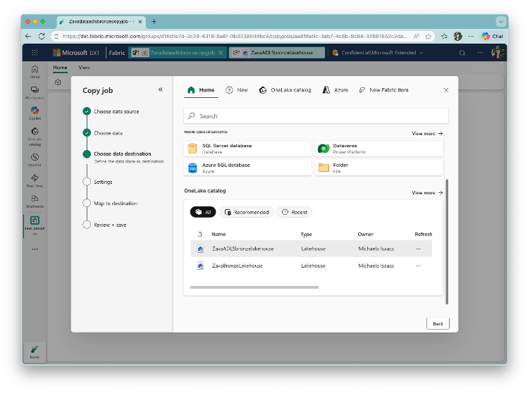

12. Choose ***Incremental copy** to detect and ingest all incremental changes, then click **Next**. 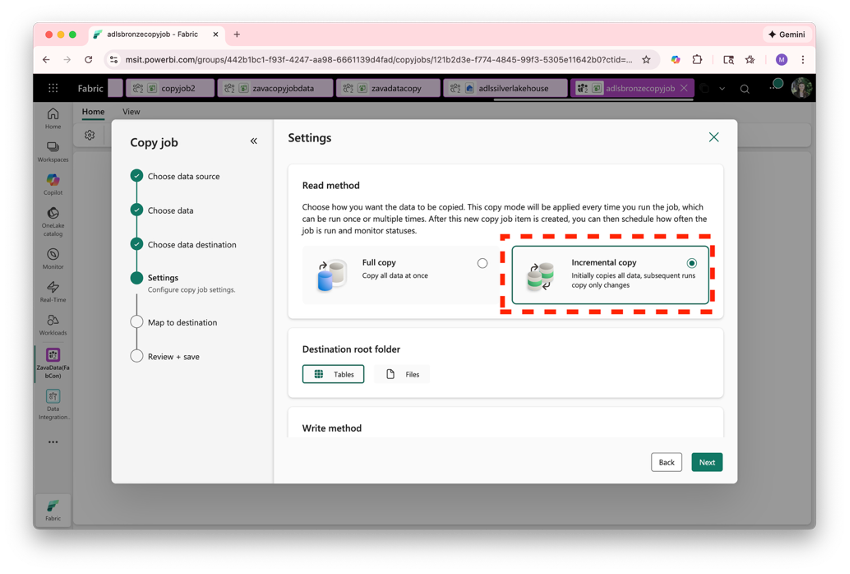

13. Under **Table mapping**, edit the schema name to \`retail\`, then click **Next**. 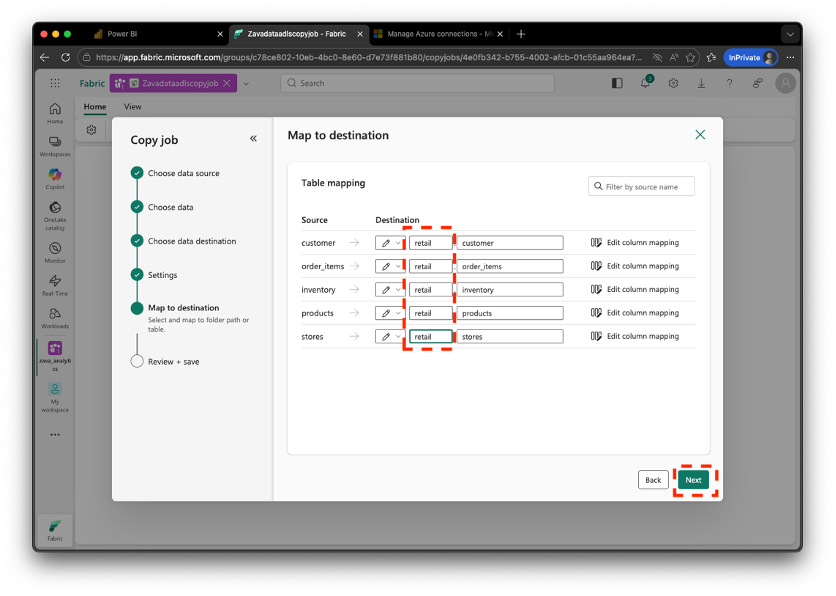

14. Review the configuration and select **Save + Run**. 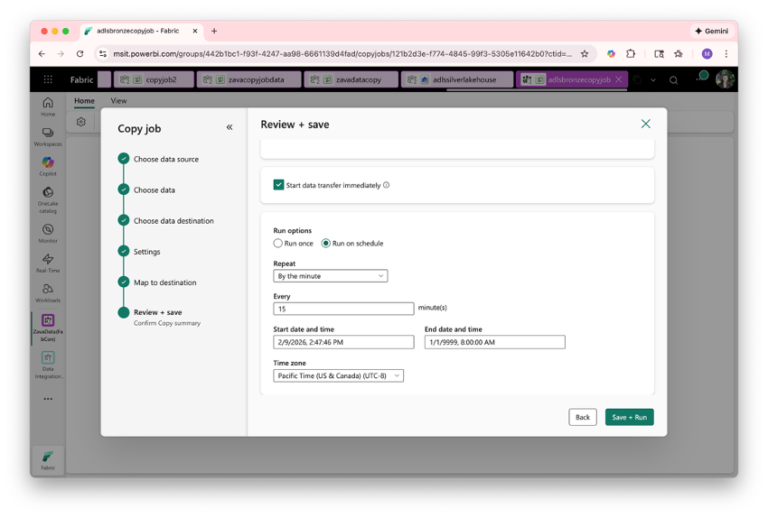

15. Select **Run**.

16. Your data should now successfully use the Copy Job to ingest Bronze data from ADLS Gen2 into your \`ZavaADLSbronzelakehouse\`.

## Testing CDC Behavior

The workshop monitors will notify you when it is time to proceed. The monitors will push changes to the ADLS Gen2, giving the Copy Job changes to copy over via CDC. We will tell you when it is time to proceed. 

Once you receive the go-ahead from the workshop monitors:

1. Run the Copy Job again by selecting **Run**. 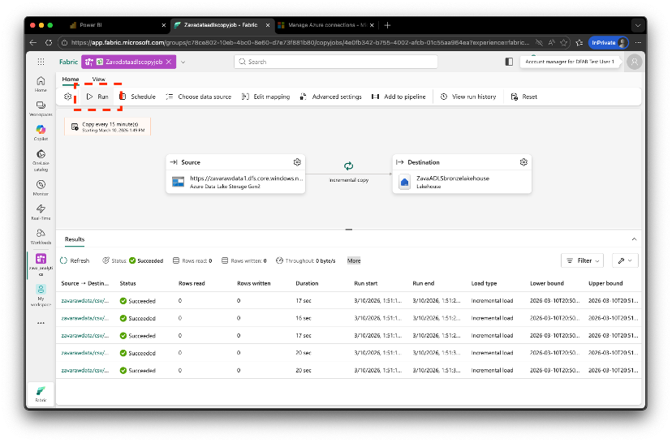

2. Only CDC changes should now be copied from ADLS Gen2 into the Lakehouse.

## ✅ Your Bronze Layer Is Now Fully Operational

By completing this lab, you have created a **CDC-enabled Copy Job** that continuously ingests incremental changes from ADLS Gen2.

Your **Bronze layer** is now live, automatically updating, and ready to feed **Silver transformations** in **Lab 3**.