# FabCon Lab 4: Build Gold Dimensional Models with dbt

In this lab, you will build a **Retail Gold** semantic layer using a dbt job. You will take your Silver tables, apply business logic, and output curated tables and views that are ready for Power BI consumption.

This process involves standardizing logic, deduplicating records, and calculating complex financial metrics such as Net Sales and Gross Margin.

## Create a dbt Project for Gold Layer Dimensional Models

1. Open your Fabric workspace. Under the **Further Transformation** medallion item, select **New item**. 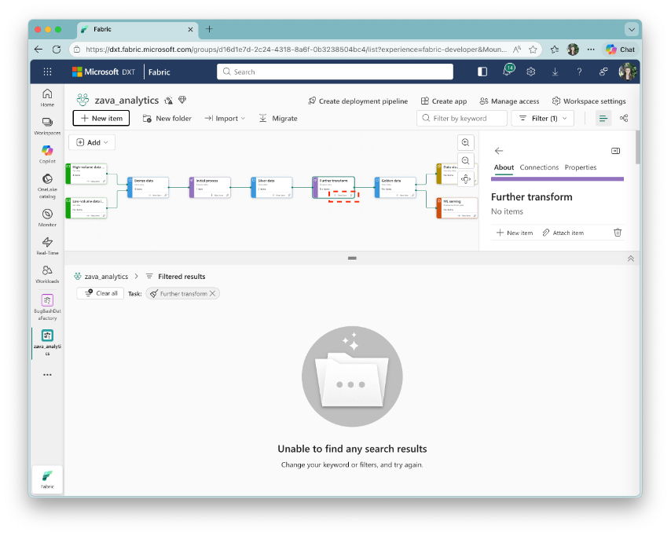

2. From the item creation menu, choose **dbt job**.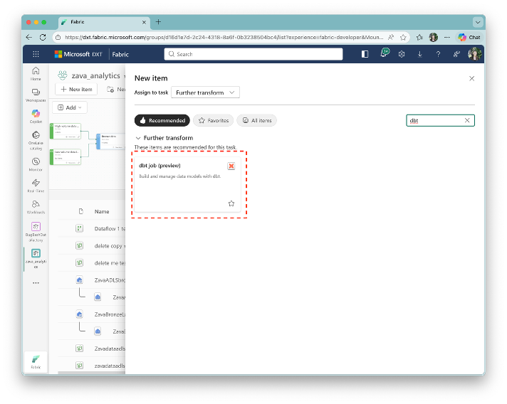

3. Name the dbt job **ZavaDataDBT**.

4. When prompted for how to start your dbt project, select **Import a project**.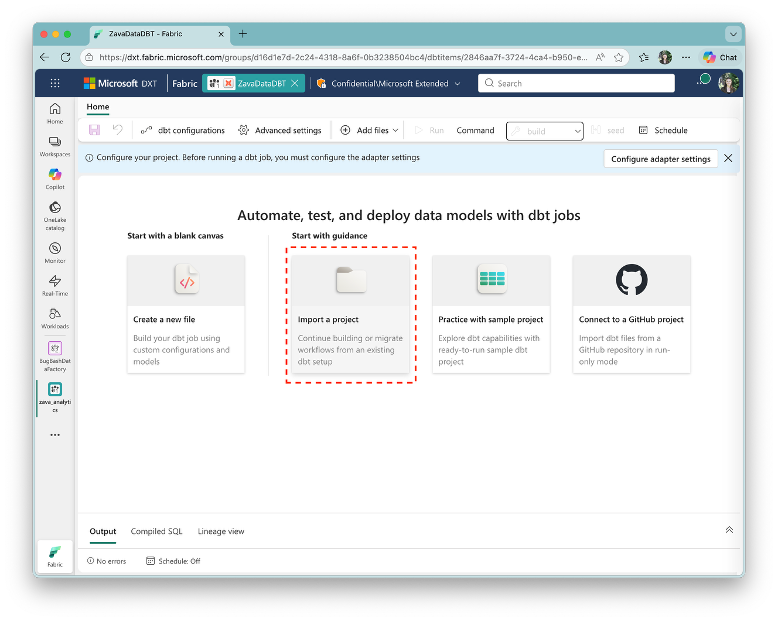

5. Select the provided workshop dbt project zip file named **fabric\_retail\_gold\_dbt.zip\** (Screenshots/fabric_retail_gold_dbt.zip) and complete the import.

6. To confirm a successful import, verify that SQL models appear in the left pane of the dbt editor.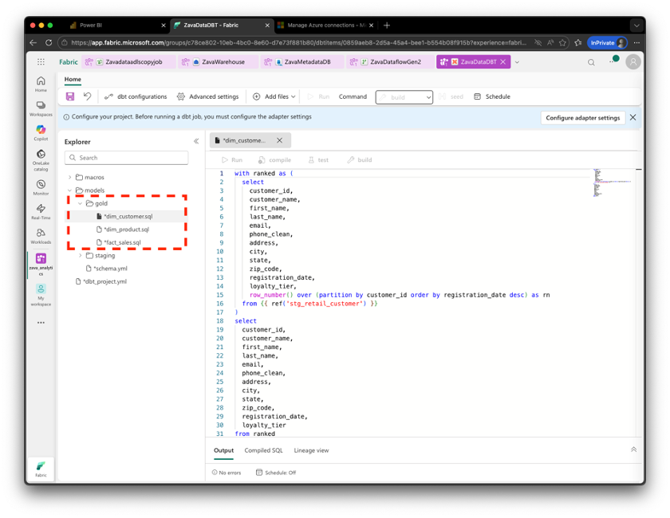

## Review the dbt Project Transformations

Within the imported dbt project, the following transformations are configured.

### Transformation 1: Establishing Standardized Logic with Macros

This transformation provides a foundation for handling inconsistent data types across the Fabric environment.
    - File: \`macros/safe\_bool.sql\`
    - Purpose: Creates a reusable macro to handle various boolean representations commonly found in retail systems, such as 0/1, true/false, and Y/N
    - Logic: Uses a CASE statement to evaluate string and integer inputs and return consistent bit-like logic for the \`\_is\_deleted\` column

### Transformation 2: Cleaning and Casting with Staging Views

This transformation builds the staging layer. These models are materialized as views to keep data fresh while minimizing storage footprint.

- `stg\_retail\_customer.sql\`
    - Concatenates \`first\_name\` and \`last\_name\` into a single \`customer\_name\`
    -  Standardizes email values to lowercase
    -  Uses \`COALESCE\` to prioritize cleaned phone numbers over raw phone data
- `stg\_retail\_products.sql\`
    -  Renames the generic \`name\` column to \`product\_name\`
    -  Casts \`unit\_price\` and \`cost\` to strict decimal precision (18,2) to ensure financial accuracy
- `stg\_retail\_order\_items.sql\`
    - Converts timestamps into clear date formats
    - Ensures \`quantity\` is cast as an integer for reliable mathematical operations

All three staging models apply a shared transformation by calling the \`is\_not\_deleted\` macro in their WHERE clause to filter out soft-deleted records.

### Transformation 3: Creating Unique Business Dimensions (Gold Tables)

These models are materialized as tables to maximize query performance.

- `dim\_customer.sql\`
    - Uses a \`ROW\_NUMBER()\` window function to deduplicate customer records
    - Ensures only the most recent registration per \`customer\_id\` is retained

- `dim\_product.sql\`
    - Applies similar deduplication logic for products
    - Introduces a new business metric called \`unit\_margin\`, calculated as \`list\_price - cost\`
    - Enables analysis of potential profit per item before sales occur

### Transformation 4: Fact Table and Star Schema Hub

This transformation creates the central sales fact table.

- File: \`gold/fact\_sales.sql\`
    - Join Logic: Performs LEFT JOINs between staging order items and gold dimensions (\`dim\_customer\` and \`dim\_product\`)
- Key Calculations:
    - Gross Sales: \`quantity \* unit\_price\`
    - Discount Amount: Calculates dollar discount based on percentage values
    - Net Sales: Uses \`line\_total\` when available, otherwise falls back to \`gross\_sales - discount\_amount\`
    - Profitability: Calculates \`gross\_margin\_amount\` using \`unit\_margin \* quantity\`

### Transformation 5: Routing and Schema Management

The project is configured to ensure all data lands in the correct schemas automatically.

    - Schema Routing: \`dbt\_project.yml\` routes staging and gold models into dedicated schemas, avoiding the \`dbo\` schema entirely

    - Source Mapping: \`sources.yml\` defines the silver schema as the starting point for all dbt models

## Configure the dbt Job in Fabric

1. Open the dbt job configuration pane.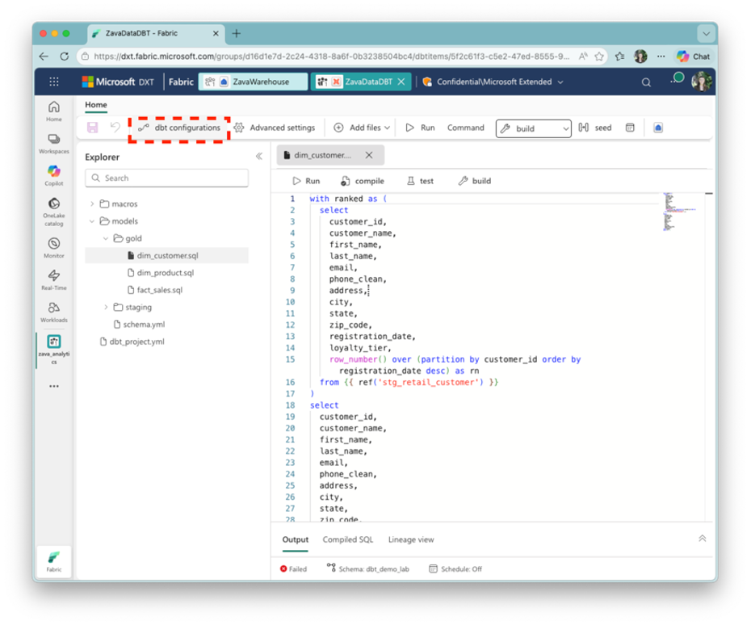

2. Select **ZavaWarehouse** as the warehouse to access silver data.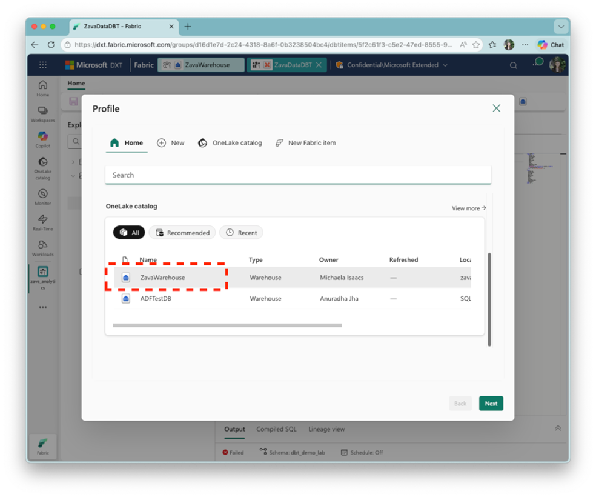

3. Ensure the schema is set to **dbo** and click **Apply**.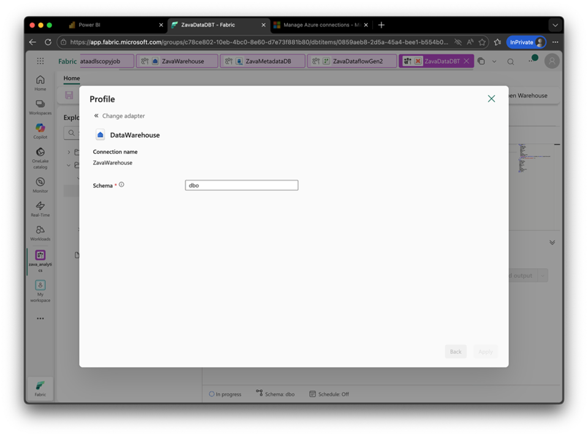

4. Edit the job to run a full **dbt build**, executing all models and dependencies, including gold models.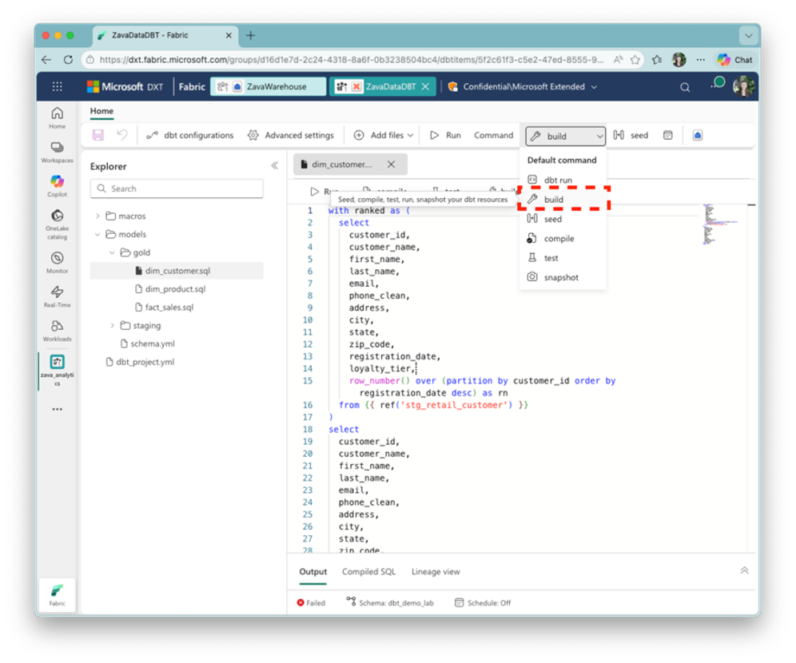

## Run the dbt Job and Validate Gold Output

1. Click **Run** and monitor the job until it completes successfully. 
    -  If the Run button is disabled, select **Save**, then try **Run** again.
    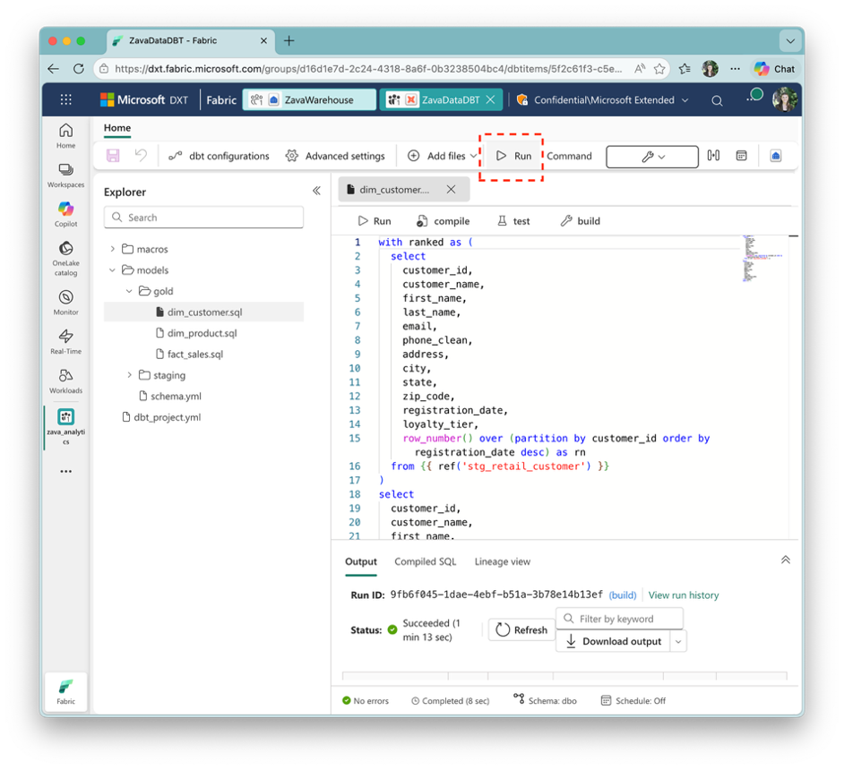
    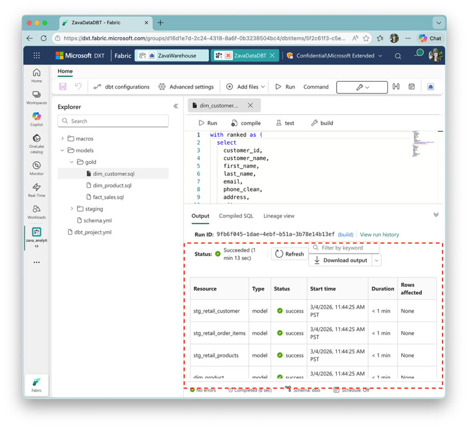

2. Return to your workspace and open **ZavaWarehouse**.

3. Verify that a **gold** schema exists in the left pane and that the expected gold tables appear beneath it. This confirms the dbt job ran successfully.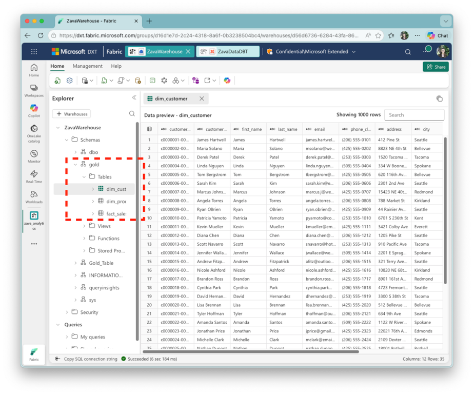

## Create a Semantic Model on Gold Data
Now you will create a semantic model over the Gold layer.

    1. Go back to your workspace and select **+ New Item**.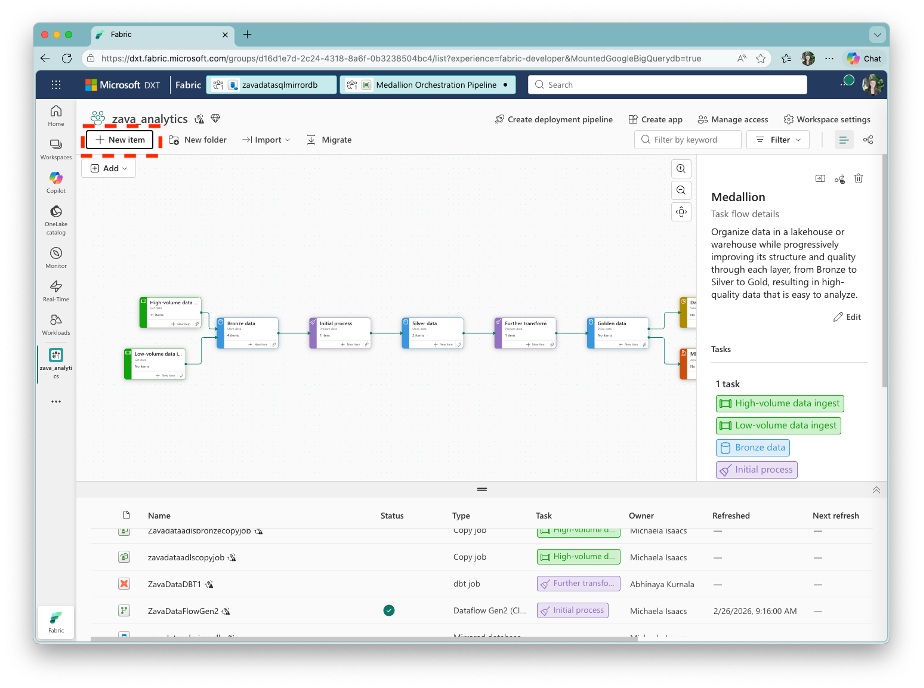
    2. Search for **Semantic Model** and select it. 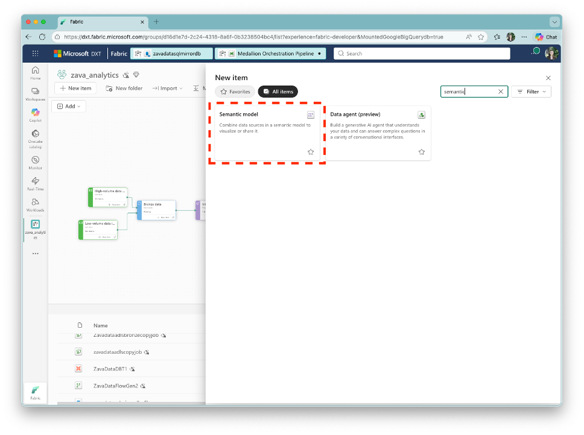
    3. Choose **OneLake Catalog** to add data.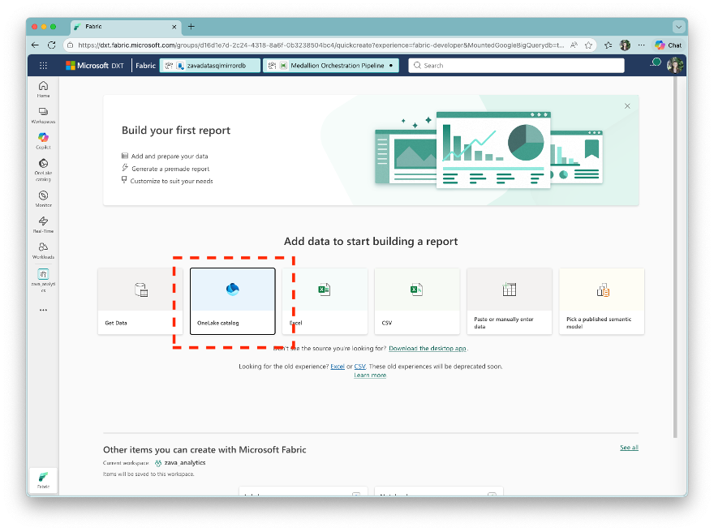
    4. Select **ZavaWarehouse** and click **Connect**.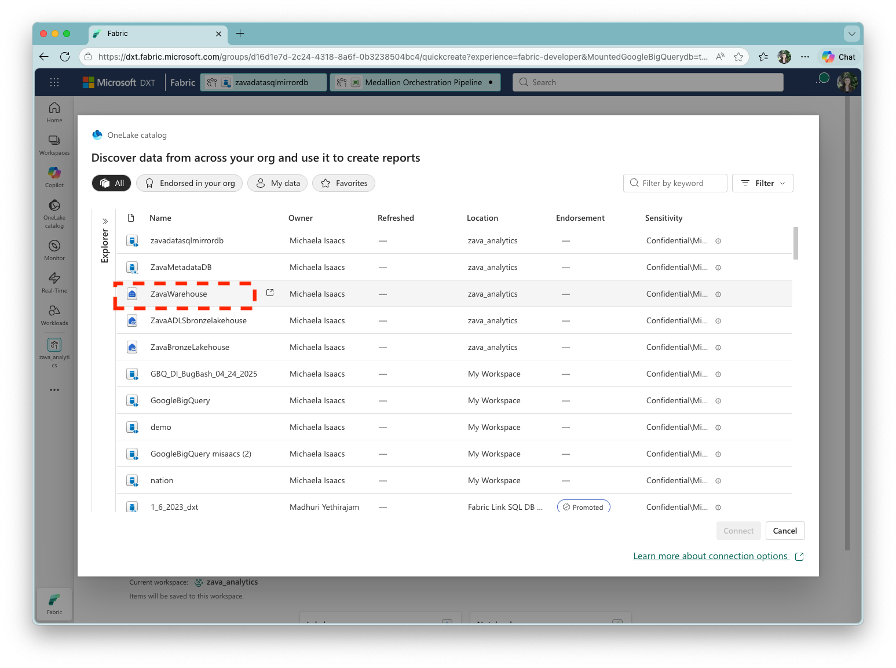
    5. Name the semantic model **ZavaDataSemanticModel**. Select all Gold tables and click **Confirm**. 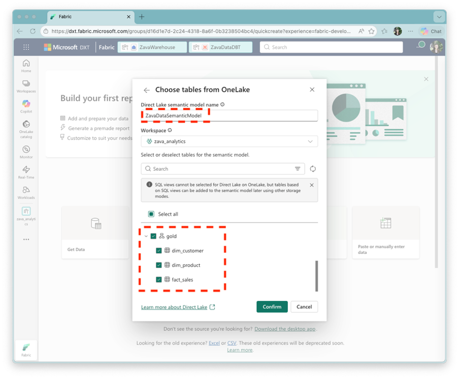
    7. The semantic model will open automatically, confirming successful creation.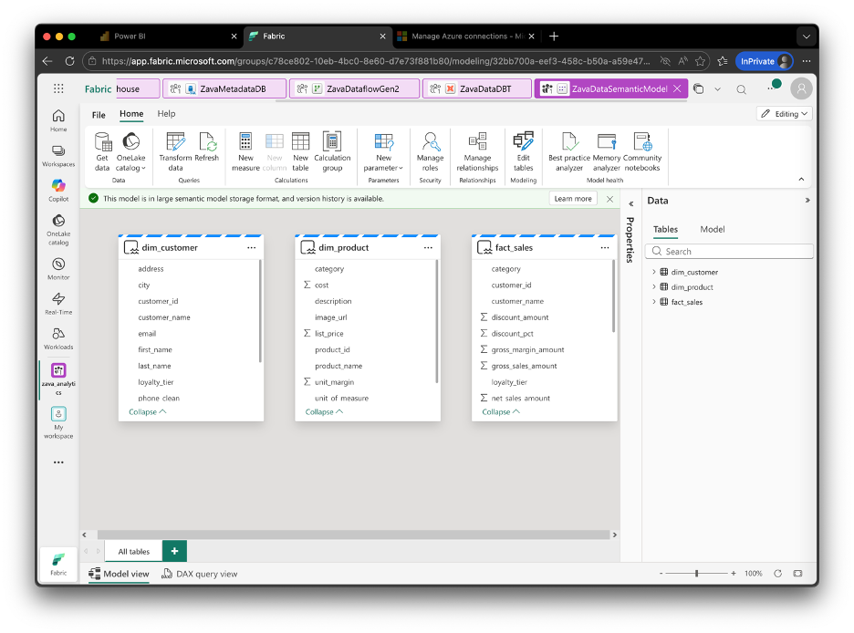

## Lab Completion
You have now imported an existing dbt project into Fabric, created gold-layer dimensional and fact models, configured and executed a dbt job, materialized the gold layer in the Fabric Data Warehouse, and applied a semantic model. You have successfully completed the medallion architecture from Bronze to Silver to Gold.