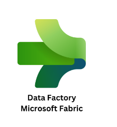

# Microsoft Fabric

# Mastering Data Factory in Microsoft Fabric: From Security to Operationalization
## Data Integration with Microsoft Fabric

## Introduction

In **FabCon Labs 1–6**, you will complete a hands-on walkthrough of **data integration in Microsoft Fabric**, focused specifically on the scenarios covered in this workshop.

Across these labs, you will build an end-to-end data flow using **Data Factory experiences**, moving data through a **medallion architecture** (bronze → silver) and validating **secure, enterprise-ready connectivity**. The labs emphasize practical workflows using **Copy Jobs**, **Dataflow Gen2**, **Lakehouse**, **Fabric Data Warehouse**, **VNet Data Gateway**, and **Outbound Access Protection (OAP)**.

By the end of Lab 6, you will have a working solution that ingests data, transforms it for analytics, and enforces network isolation and outbound controls—all using the Fabric experiences exercised in this workshop.

---

## Prerequisites (Already Done For Lab Participants)

The labs require the following setup in Microsoft Fabric:

- **Microsoft Fabric enabled in your tenant**
- **Premium capacity available**, using either:
  - Paid capacity (P or F SKUs), or
  - Microsoft Fabric Trial (Preview)

> **Note:** Premium Per User (PPU) is **not supported** for creating the Fabric items used in these labs.

---

## Getting Started and Architecture Setup (Lab 1)

In **Lab 1**, you set up the foundation used throughout the workshop.

You will:
- Create and configure a Fabric workspace
- Establish a **medallion architecture task flow**
- Understand how Data Factory experiences fit together inside Fabric

This lab provides the structural context for all subsequent labs.

---

## Ingesting Data into the Bronze Layer (Lab 2)

In **Lab 2**, you focus on ingesting raw data into Fabric.

You will:
- Create a **Lakehouse** to store bronze data
- Use a **Copy Job** to ingest data from ADLS Gen2
- Validate successful data landing in the bronze layer

This lab establishes the raw data layer that downstream transformations depend on.

---

## Transforming Data from Bronze to Silver (Lab 3)

In **Lab 3**, you curate and clean your data.

You will:
- Build transformations using **Dataflow Gen2**
- Apply column shaping, formatting, and text cleanup
- Write transformed outputs to a **Fabric Data Warehouse** as silver tables

This lab demonstrates how Fabric supports low-code data preparation for analytics-ready datasets.

---

## Building Gold Dimensional Models with dbt (Lab 4)

In **Lab 4**, you build the Gold layer of the medallion architecture.

You will:
- Import a dbt project into Fabric and configure a dbt job
- Apply business logic to Silver tables to produce curated Gold dimensions and fact tables
- Validate Gold output in the Fabric Data Warehouse
- Create a **Semantic Model** over the Gold layer for Power BI consumption

This lab completes the Bronze → Silver → Gold medallion transformation pipeline.

---

## End-to-End Orchestration with Metadata (Lab 5)

In **Lab 5**, you orchestrate the full medallion pipeline using metadata-driven execution.

You will:
- Build a **Medallion Orchestration Pipeline** in Fabric that chains Copy Job, Dataflow Gen2, dbt job, and Semantic Model refresh activities
- Drive conditional execution using a **Lookup activity** reading from the metadata SQL database created in Lab 1
- Update metadata values and observe which pipeline stages execute
- (Optional) Explore an advanced pattern using ForEach, audit tables, and Lakehouse notebooks

This lab demonstrates how Fabric enables coordinated, repeatable, and operationally controllable data workflows.

---

## Secure Connectivity and Network Isolation (Lab 6)

In **Lab 6**, you secure your data integration solution.

You will:
- Validate connection failures under network isolation
- Configure and use a **VNet Data Gateway**
- Enable **Outbound Access Protection (OAP)**
- Allow only approved gateways for outbound access
- Confirm secure data movement with OAP and VNet enforced

This lab demonstrates how Fabric supports enterprise security requirements without changing your data logic.

---

## Completion Summary

By completing **FabCon Labs 1–6**, you have:

- Built a working **medallion architecture** in Microsoft Fabric  
- Ingested data using **Copy Jobs**  
- Transformed data using **Dataflow Gen2**  
- Written curated silver data to a **Fabric Data Warehouse**  
- Built Gold dimensional and fact models using a **dbt job**  
- Orchestrated the full pipeline with **metadata-driven execution**  
- Enforced **network isolation and outbound access controls**  

The resulting solution reflects exactly the patterns and capabilities exercised in this workshop and can be re-run, extended, or secured further using the same Fabric experiences.

Want to try your new Data Factory knowledge? Want to win some fun prizes? Participate in our Data Factory Community Contest! Check out the [contest description](https://community.fabric.microsoft.com/t5/AI-Ready-Data-Gallery/bd-p/df_aireadydata_gallery?featured=yes) to learn more!

